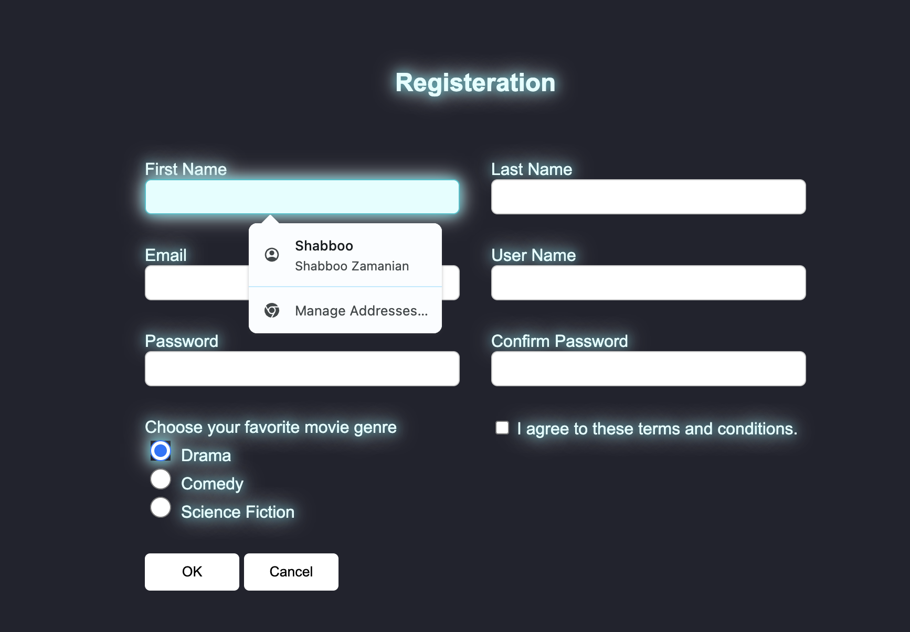

# Registration Form Project

This project is a vibrant, color-focused registration form built using HTML and CSS. The design emphasizes colors, lights, and shadows to create a visually engaging form experience. The form allows users to enter personal information, select a favorite movie genre, and agree to terms and conditions. Submitted data is sent to a mock server for demonstration.

## Project Overview

This form project combines personal information entry with visual effects that highlight colors, lights, and shadows. Users can enter information, select a favorite movie genre, and submit. The form demonstrates the use of CSS techniques to create a glowing, eye-catching layout.

## Features

- **Form Fields**: Includes First Name, Last Name, Email, Username, Password, Confirm Password.
- **Favorite Movie Genre Selection**: Choose from Drama, Comedy, or Science Fiction.
- **Terms and Conditions Checkbox**: Ensures compliance with terms before submitting.
- **Submit and Cancel Buttons**: Basic form controls.
- **Vibrant Visual Design**: Emphasis on color contrast, glowing effects, and shadow layers for a unique look.
- **Responsive Layout**: Optimized for both desktop and mobile screens.

## Technologies Used

- **HTML5**: For form structure and layout.
- **CSS3**: Styling, layout, and effects, including lights and shadows.
- **CSS Flexbox & Grid**: Alignment and spacing of form elements.

## Folder Structure

neon-registration-form
```plaintext
├── index.html        # Main HTML file
├── style.css         # CSS file for styling
└── README.md         # Documentation file
```

## Design Details
### Colors, Lights, and Shadows
The project leverages colors, light effects, and shadows to create a vibrant look:

- **Primary Color**: A cool cyan color (#00c2cb) is used for borders and highlights.
- **Text Shadows**: Glowing text shadows create a layered, illuminated effect.
- **Element Shadows**: Input fields and buttons have shadow layers for depth and contrast, enhancing the form’s 3D look.
- **Hover Effects**: Buttons have glowing effects and shadow changes on hover.

